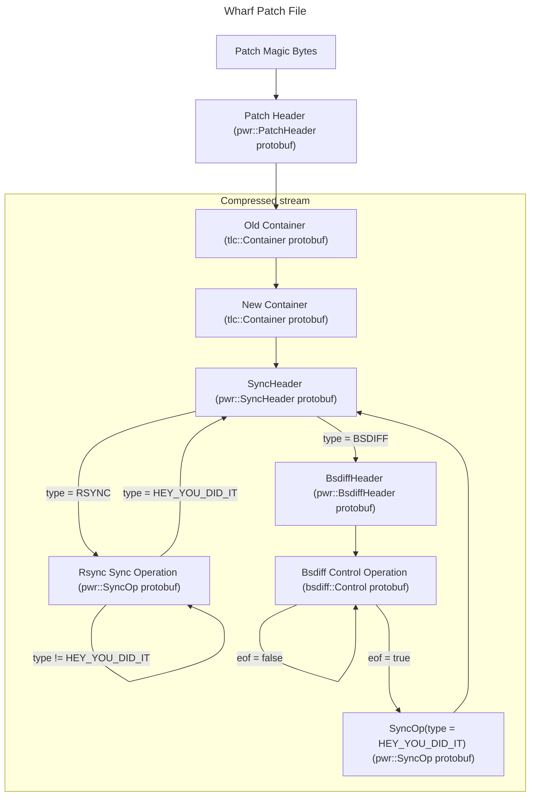

```mermaid
---
title: Wharf Patch File
---
flowchart TB
    Magic["Patch Magic Bytes"] --> PatchHeader["Patch Header (pwr::PatchHeader protobuf)"]
    PatchHeader --> ContainerOld
    subgraph Compressed["Compressed stream"]
        ContainerOld["Old Container (tlc::Container protobuf)"] --> ContainerNew["New Container (tlc::Container protobuf)"]
        ContainerNew --> SyncHeader["SyncHeader (pwr::SyncHeader protobuf)"]
        SyncHeader -->|"type = RSYNC"| SyncOp["Rsync Sync Operation (pwr::SyncOp protobuf)"]
        SyncOp --->|"type = HEY_YOU_DID_IT"| SyncHeader
        SyncOp -->|"type != HEY_YOU_DID_IT"| SyncOp
        SyncHeader -->|"type = BSDIFF"| BsdiffHeader["BsdiffHeader (pwr::BsdiffHeader protobuf)"]
        BsdiffHeader --> Control["Bsdiff Control Operation (bsdiff::Control protobuf)"]
        Control -->|"eof = false"| Control
        Control ---->|"eof = true"| HeySyncOp["SyncOp(type = HEY_YOU_DID_IT) (pwr::SyncOp protobuf)"]
        HeySyncOp --> SyncHeader
    end
```