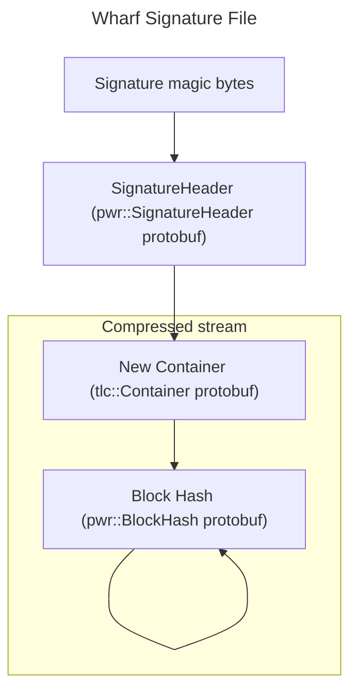

```mermaid
---
title: Wharf Signature File
---
flowchart TB
    Magic["Signature magic bytes"] --> SignatureHeader["SignatureHeader (pwr::SignatureHeader protobuf)"]
    SignatureHeader --> ContainerNew
    subgraph Compressed["Compressed stream"]
        ContainerNew["New Container (tlc::Container protobuf)"] --> BlockHash["Block Hash (pwr::BlockHash protobuf)"]
        BlockHash --> BlockHash
    end
```