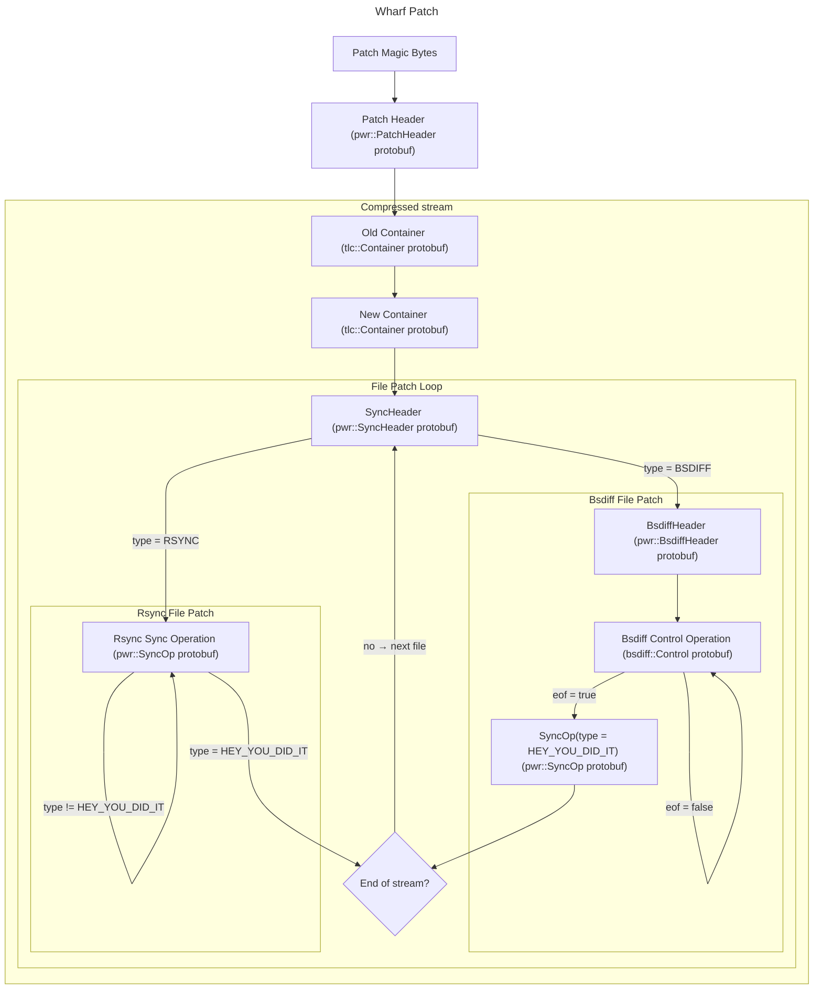

# Wharf Patch Format

Excluding the magic bytes, the binary patch consists only on protobuf
messages.

## Magic bytes

The first four bytes of a wharf patch are the magic bytes: `0x0FEF_5F00`
(in little endian)

## Header

The first protobuf message is a header that determines the compression
used for the remaining data. Currently, the only supported compressions
in wharf are:

 - Brotli (used on default patches),
 - Zstandard (used on optimized patches)
 - gzip (not currently in use in itch.io, but supported anyways)

Additionally, the header message also specifies the compression quality,
but it isn't useful for decompressing the patch.

## Containers

After the header, the two next protobuf messages are the old and the new
containers. They indicate the files, folders and symlinks of the old and
the new build folders, and their mode (permissions). Also, they indicate
the size of each file.

## Patch Operations Loop

At this point, the patch operations start. Each header indicates the file
index in the new container to patch and the algorithm used for patching it.

### Rsync Patching

If the algorithm is rsync, a sync op loop begins. Each sync operation can
be of three different types:

 - BlockRange: copy, from the file at the file_index in the old container,
bytes from the block_index * BLOCK_SIZE byte, during block_span * BLOCK_SIZE
bytes
 - Data: copy the raw bytes in the data field directly to the new file
 - HeyYouDidIt: this sync op loop has ended

### Bsdiff Patching

If the algorithm is bsdiff, then the next protobuf message after the sync
header will be a bsdiff header, which indicates which old file will be used
for the patching.

Then, the control operation loop begins. Each control bsdiff operation
has four fields:

 - add (raw bytes): add these bytes (arithmetic add) to the old file's
ones at the current position and copy them into the new file
 - copy (raw bytes): copy these bytes directly to the new file
 - seek (int64): move the old file cursor forward (positive number) or
backwards (negative number)
 - eof (bool): when true, the control operation loop ends

After the last control operation, a SyncOp protobuf message with the type
field set to HEY_YOU_DID_IT will be placed.

