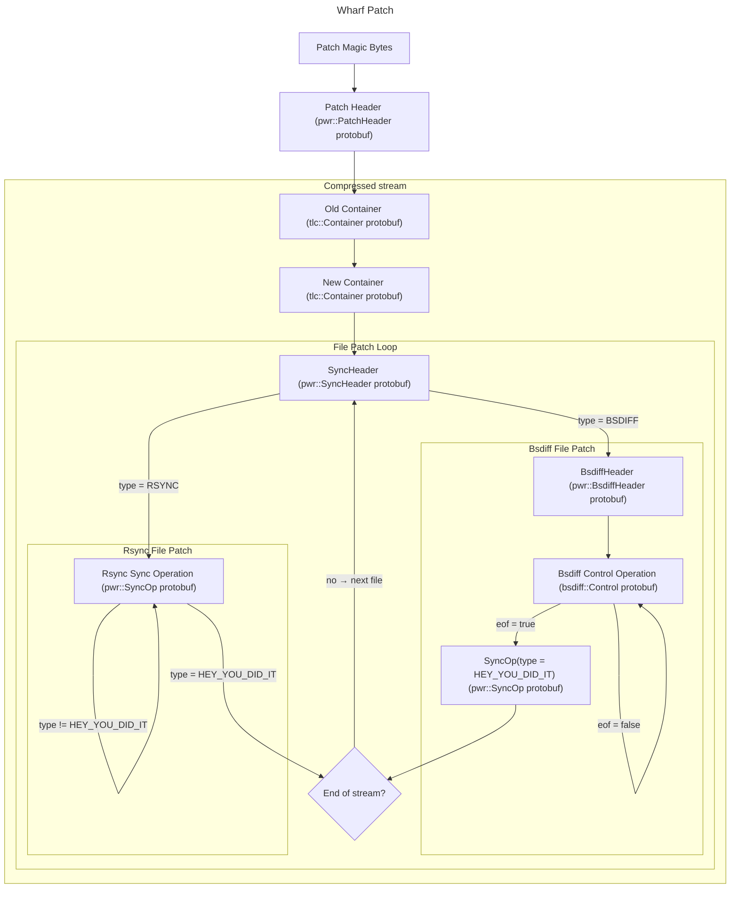

# Wharf Patch Format

Excluding the magic bytes, the binary patch consists only on protobuf
messages.

## Magic bytes

The first four bytes of a wharf patch are the magic bytes, which are
represented as `0x0FEF_5F00` in little-endian format.

## Header

The first protobuf message is a header that determines the compression
used for the remaining data. Currently, the only supported compressions
in wharf are:

 - Brotli (used on default patches)
 - Zstandard (used on optimized patches)
 - gzip (not currently used by itch.io, but still supported)

Additionally, the header message also specifies the compression quality,
but this information is not useful for decompressing the patch.

## Containers

Following the header are the two protobuf messages indicating the old
and new containers. These messages indicate the files, folders, and
symlinks of the old and new build folders and their permissions. They
also indicate the size of each file.

## Patch Operations Loop

At this point, the patch operations begin. Each header indicates the
file index in the new container to patch and the algorithm used for
patching it.

### Rsync Patching

If the algorithm is **rsync**, a _sync op loop_ begins. Each sync
operation can be of three different types:

 - BlockRange:
   - Read the fields `file_index`, `block_index` and `block_span`
   - Open the file with index `file_index` in the old container
   - Copy data from the old file into the new file, starting at
`block_index * BLOCK_SIZE` and spanning `block_span * BLOCK_SIZE` bytes
 - Data
   - Copy the raw bytes contained in the `data` field directly into
the new file
 - HeyYouDidIt
   - Indicates the end of the sync operation loop for the current file

### Bsdiff Patching

If the selected algorithm is **bsdiff**, the protobuf message immediately
following the patch header is a _bsdiff header_. This header specifies
which file from the old container will be used as the basis for patching.

After the bsdiff header, the _control operation loop_ begins. Each bsdiff
control operation contains the following fields:

 - add (raw bytes)
   - Perform a byte-wise arithmetic addition between these bytes and the
bytes from the old file at the current cursor position, and write the
result to the new file
 - copy (raw bytes)
   - Copy these bytes directly to the new file
 - seek (`int64`)
   - Move the cursor in the old file forward (positive values) or backward
(negative values)
 - eof (`bool`)
   - When set to true, indicates the end of the control operation loop

After the final control operation, a `SyncOp` protobuf message  with its
`type` field set to `HEY_YOU_DID_IT` is emitted to terminate the patching
process for the current file.

