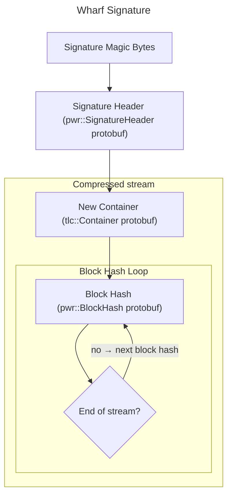

# Signature Patch Format

Excluding the magic bytes, the binary signature consists only on
protobuf messages.

## Magic bytes

The first four bytes of a wharf signature are the magic bytes:
`0x0FEF_5F01` (in little endian)

This is the patch magic bytes plus one.

## Header

The first protobuf message is a header that determines the compression
used for the remaining data. Currently, the only supported compressions
in wharf are:

 - Brotli (used on signatures)
 - Zstandard (not used on signatures)
 - gzip (not currently in use in itch.io, but supported anyways)

Additionally, the header message also specifies the compression quality,
but it isn't useful for decompressing the signature.

## New Container

After the header, the next protobuf message is the new container. It
indicates the files, folders and symlinks of the build folder, and their
mode (permissions). Also, it indicates the size of each file.

## Block Hash Loop

At this point, the block hash operations start. Each message indicates
the hash of the current block of bytes of size BLOCK_SIZE. The blocks
have a fixed size and are read from the container files in order.

Each block hash message contains:

 - A weak hash: the weak hashing algorithm used in the original RSync
paper
 - A strong hash: MD5

