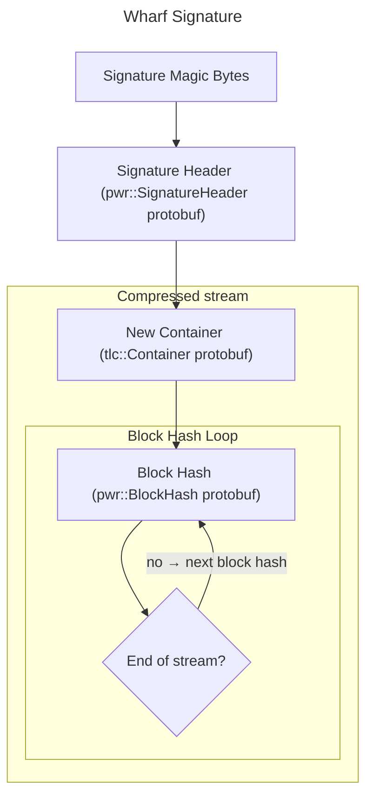

```mermaid
---
title: Wharf Signature
---
flowchart TB
    Magic["Signature Magic Bytes"] --> SignatureHeader["Signature Header (pwr::SignatureHeader protobuf)"]
    SignatureHeader --> ContainerNew
    subgraph Compressed["Compressed stream"]
        ContainerNew["New Container (tlc::Container protobuf)"] --> BlockHash["Block Hash (pwr::BlockHash protobuf)"]
        subgraph BlockHashLoop["Block Hash Loop"]
            BlockHash --> EOF
            EOF{"End of stream?"} -->|"no → next block hash"| BlockHash
        end
    end
```