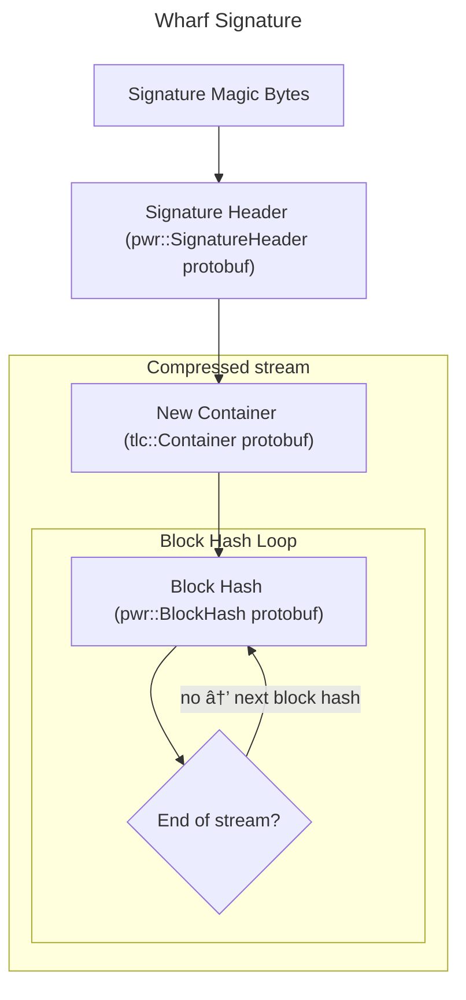

# Signature Patch Format

Excluding the magic bytes, the binary signature consists only on
protobuf messages.

## Magic bytes

The first four bytes of a wharf signature are the magic bytes,
which are represented as `0x0FEF_5F01` in little-endian format.

This is the patch magic bytes plus one.

## Header

The first protobuf message is a header that determines the compression
used for the remaining data. Currently, the only supported compressions
in wharf are:

 - Brotli (used on signatures)
 - Zstandard (not used on signatures)
 - gzip (not currently used by itch.io, but still supported)

Additionally, the header message also specifies the compression quality,
but this information is not useful for decompressing the signature.

## New Container

After the header, the next protobuf message is the new container. It
indicates the files, folders and symlinks of the build folder, and their
mode (permissions). It also indicates the size of each file.

## Block Hash Loop

At this point, the block hash operations begin. Each message contains
the hash of the current block of BLOCK_SIZE bytes. The blocks have a
fixed size and are read from the container files in order.

Each block hash message contains:

 - A weak hash, which is the weak hashing algorithm used in the original
RSync paper
 - A strong hash: MD5

